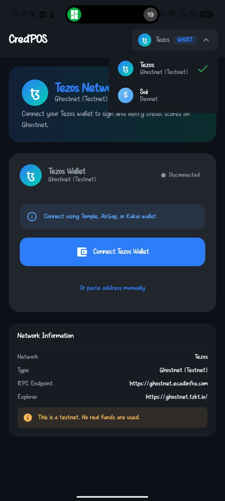

# 📱 CredPOS Mobile: The DeFi-Integrated Point of Sale


> **"Bridging the Gap Between Traditional Retail and Decentralized Finance."**

---

## 🚀 Overview

**CredPOS Mobile** is a cutting-edge Android application engineered for the modern merchant. Unlike standard POS systems, CredPOS integrates **Multi-Chain Wallet Connectivity**, allowing users to leverage their on-chain reputation for credit scoring.

Built with **Native Android (Kotlin)** and a custom **Capacitor Bridge**, it delivers a seamless, high-performance experience that works offline and syncs instantly when connected.

---

## 🌟 Key Features

### 🔗 **Multi-Chain Wallet Connect**
One app, multiple blockchains. CredPOS eliminates the complexity of Web3 integration.
- **Tezos (Ghostnet)**: Seamless integration via **Beacon-like** TZIP-10 patterns.
- **Sui (Devnet)**: Native support for **Sui Wallet** standards.
- **Smart Tech**: Auto-detects installed wallets (Temple, AirGap, Sui Wallet, Ethos).

### 💳 **Revolutionary Credit Scoring**
- **On-Chain Identity**: Sign your credit score directly to the blockchain.
- **Immutable Reputation**: Build a verifiable financial history that follows you everywhere.
- **Non-Custodial**: We never touch your private keys. You stay in control.

### 🛡️ **Enterprise-Grade Security**
- **Encrypted Storage**: Sensitive session data is AES-256 encrypted using Android's Keystore system.
- **Secure Bridge**: Custom-built native bridge ensures safe communication between the Web UI and native blockchain SDKs.
- **Sandboxed Execution**: Every transaction runs in a secure, isolated environment.

---

## 🛠️ Technology Stack

| Component | Technology | Description |
|-----------|------------|-------------|
| **Core** | **Kotlin** | Native Android development for maximum performance. |
| **UI** | **Jetpack Compose** | Modern, declarative UI toolkit for beautiful interfaces. |
| **Architecture** | **MVVM + Clean** | Scalable, testable, and maintainable code structure. |
| **Bridge** | **Capacitor** | High-speed communication layer for hybrid features. |
| **Blockchain** | **Tezos & Sui SDKs** | Direct integration with blockchain networks. |

---

## 📱 Application Preview

| Dashboard | Wallet Connect | Settings |
|:---:|:---:|:---:|
| *Intuitive POS Interface* | *Multi-Chain Selector* | *Backup & Configuration* |
|  |  |  |

---

## 📂 Project Architecture

A glimpse into our clean code structure:

```kotlin
com.credpos.app
├── blockchain/         # 🧠 Core Blockchain Logic & Network Switching
│   ├── CryptoNetwork.kt      # Type-safe Network Definitions
│   └── BlockchainRepository.kt # Abstracted Wallet Operations
├── ui/                 # 🎨 Beautiful Jetpack Compose UI
│   ├── components/           # Reusable Design System
│   └── screens/              # Feature-rich Screens
└── viewmodel/          # ⚡ Reactive State Management (Coroutines/Flow)
```

---

## 🏆 Hackathon Submission Details

This repository represents the **Mobile Client** of the CredPOS ecosystem.

- ** APK Download**: [Link to APK (Google Drive)]
- ** Demo Video**: [Link to Video]
- ** Web Dashboard**: [Link to Web Repo]

---

*Built with ❤️ by the CredPOS Team for Hacktoon 2026.*
